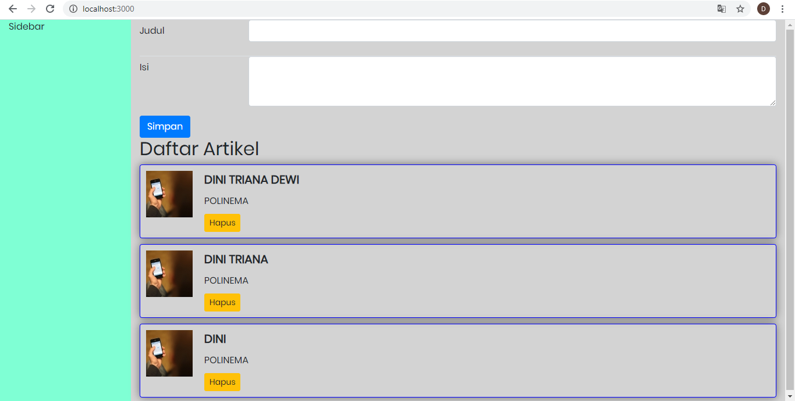

# Jawaban Pertanyaan Pertemuan 5

## Praktikum 1
a) 1. Container Fluid  Container  2. Jika container-fluid, menggunakan max-width 100%, jadi ukuran konten akan penuh di browser tetapi container akan ada space di bagian kanan kiri.

b) Jika ingin mengimport component bootstrap tetapi component itu belum terdapat dimodul maka install component bootstrapnya.

## Praktikum 2
a. Agar server-json dan project reactJS semuanya bisa berjalan.

b. Kenapa tidak pada satu port karena jika server-json dan project reactJS bersamaan pada satu port maka tidak bisa berjalan karena akan tertumpuk yang terkahir dibuka.

## Praktikum 3
a. Jika di klik button hapus maka data akan terhapus.

b. Pada listArtikel data yang terhapus otomatis terhapus juga pada listArtikel.json karena seperti halnya database.

c. Fungsi handleHapusArtikel untuk menghapus data sesuai dengan ID data.

d. Perbedaan fungsi componentDidMount dan fungsi componentDidMount() jika componentDidMount untuk get datanya langsung tetapi jika componentDidMount() untuk memanggil fungsi.

## Praktikum 4
a. Pada file listArtikel.json akan muncul data baru yang ditambahkan pada browser.

b. Data terbaru berada di posisi atas dan data lama berada di bawah karena pada fungsi ambilDataDariServerAPI() terdapat fungsi order pada fetch yaitu "_sort=id&_order=desc" yang berarti diurutkan sesuai dengan ID dengan desc / dari angkat terbesar.